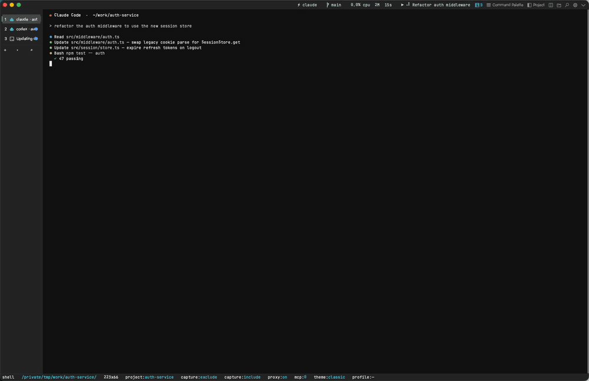

# Unterm

**The terminal AI agents can drive.**



Cross-platform terminal (macOS / Linux / Windows) built on Unterm's native
`next-core` terminal engine, with one design bet: the terminal itself is
controllable from the outside by any AI agent over MCP. Claude Code, Codex,
Gemini CLI, Cursor, Aider, your own scripts — they all get the same JSON-RPC
surface (**103 authenticated methods plus `auth.login`**) to spawn shells, run
commands, read pane state, capture screenshots, change settings, and record
sessions.

Since v0.55 the relationship runs both ways: agents drive the terminal from outside, and the terminal is an **Agent Cockpit** for the agents running inside it — live per-pane agent state, a waiting-first Inbox, fleets of N agents on one task in N isolated git worktrees, and a Review page to diff / merge / roll back what they produced.

The other 2026 terminals each pick a different side: Warp embeds AI inside a closed cloud (Oz), Ghostty stays out of your way and lets you bring your own tools, iTerm2 is Mac-only. Unterm picks the third side — terminal as MCP-controllable surface, deliberately keep AI *generation* out of the terminal, let external agents grip it through the API, and give the human one cockpit to run them all from.

Practical implications:

- Every Unterm window starts a local **MCP server** (line-delimited JSON-RPC over TCP) and a local **HTTP settings server** (Web Settings page) on auto-allocated ports. Both are auth-token gated, both are 127.0.0.1-only, no cloud round trip.
- **Settings live in the browser**, not the terminal. Cell-grid TUIs can't deliver modern form UX (no proper text inputs, no live preview, no color picker). The in-terminal `▼` menu holds quick actions and links out to the Web Settings page — configuration itself happens in the browser.
- **9 languages out of the box**: en / 简体中文 / 繁體中文 / 日本語 / 한국어 / Deutsch / Français / Italiano / हिन्दी. Auto-detects from system locale, can be overridden in Web Settings or via `unterm-cli lang set <code>`.
- **Multi-instance discovery**: every running Unterm process owns one NATO-named instance (alpha, bravo, charlie…) and writes its ports + auth token to `~/.unterm/instances/<name>.json`. Agents that drive several windows at once enumerate that directory.
- **Cross-platform parity is a correctness property**: if a feature works on Windows but bails on macOS or Linux, that's a bug, not "not supported yet."
- **Subtraction over decoration**: no AI chat overlay inside the terminal and
  no cloud dependency for core operation. Proxy settings auto-detect the
  system by default and also support explicit HTTP/SOCKS overrides, node pools,
  rotation, and Clash/mihomo controllers. Finder integration on macOS uses the
  native Finder right-click extension and Services.

The GUI and terminal runtime now use Unterm's native `next-core` engine. The
repository still carries selected upstream components and attribution where
they remain dependencies, but WezTerm mux/window state is no longer the
product kernel.

---

## Agent Cockpit

Run Claude Code, Codex, Gemini CLI, or Aider in any pane and Unterm sees them — no configuration, no wrapper. Five pillars, all local:

- **Agent state engine** — every pane's agent and its state (working / waiting-for-you / idle / done), read from OSC progress + title signals, process fingerprints, and optional official hooks. Tab badges + a cross-window tally chip in the top bar.
- **Inbox** (`Ctrl+Shift+A`) — every agent that's waiting for you in one queue, longest-waiting first. Enter jumps to the pane; one keystroke later you've answered its prompt.
- **Fleet** — one task × N agents × N isolated git worktrees (`../<repo>.fleet/`), one tab each. Same agent ×3 for throughput, or `claude,codex,gemini` for a bake-off.
- **Review** — agents get checkpointed before they touch a repo (dangling-commit snapshots; nothing touches your HEAD or index). A Web Review page shows per-member diffs with squash-merge (stops at staged — the commit stays yours), discard, and rollback. Since v0.57, Review also **verifies** each member (inferred or explicit validation command), **ranks** members by verification + change size, gates merge on a passing run, and can **retry** a failed member in its existing worktree.
- **Everything scriptable** — the cockpit itself is MCP + CLI: `agent.status`, `cockpit.inbox`, `fleet.launch`, `review.merge`… an orchestrating agent can run fleets and review diffs with no human in the chair.

```bash
unterm-cli agent status                                  # who's running where, in what state
unterm-cli agent inbox                                   # who's waiting for you
unterm-cli agent enable-hooks                            # exact state via official hooks (merge-only, backed up)
unterm-cli fleet launch --agents claude,codex "fix the flaky auth test"
unterm-cli review verify --fleet <id> --member 1         # run the member's validation
unterm-cli review list && unterm-cli review open         # ranked diffs in the browser
```

Full docs: [unterm.app/docs/agent-cockpit](https://unterm.app/docs/agent-cockpit).

---

## Install

Pre-built artifacts are published on GitHub Releases:

https://github.com/zhitongblog/unterm/releases

| Platform | Artifact                                                    |
| -------- | ----------------------------------------------------------- |
| macOS    | `Unterm-macos-<version>.dmg` (universal arm64+x86_64, signed + notarized) |
| Linux    | `unterm-<version>.deb` or `Unterm-<version>-x86_64.AppImage` |
| Windows  | `Unterm-<version>-x64.msi` or `Unterm-windows-x64-<version>.zip` |

### macOS

Double-click `Unterm-macos-<version>.dmg`, then drag `Unterm.app` onto the
`Applications` shortcut. The DMG is signed with a Developer ID and Apple-
notarized, so Gatekeeper opens it on first launch without warnings.

Finder integration is bundled in the DMG. After the first launch, Finder's
right-click menu can show `Open in Unterm` for folders and files; if macOS
doesn't refresh the extension immediately, run `Repair Finder Integration.app`
from the DMG once.

### Linux (Debian / Ubuntu)

```bash
sudo apt install ./unterm-<version>.deb
unterm
```

Other distros — use the AppImage:

```bash
chmod +x Unterm-<version>-x86_64.AppImage
./Unterm-<version>-x86_64.AppImage
```

### Windows

Run the MSI installer; it places `unterm.exe` in `Program Files\Unterm` and creates a Start Menu shortcut.

---

## What's new

- **v0.57 — Fleet verification loop + new brand mark.** Review now verifies each fleet member automatically (Cargo / Go / npm / pnpm / yarn / Python / Maven / Gradle / .NET inferred, or your own command), ranks members by verification and change size, gates squash-merge on a passing run (audited `force` override), and retries failed members in their existing worktree without losing work — `review.verify` / `fleet.retry` over MCP + CLI. The sidebar gains repository-grouped navigation with always-on fuzzy search. Every logo surface moves to the new command-loop mark.
- **v0.55 — Agent Cockpit.** The terminal now sees the agents inside it: live per-pane state with tab badges and a cross-window tally, the waiting-first Agent Inbox (`Ctrl+Shift+A`), fleets running one task across N agents in N isolated worktrees, and a Review page with checkpoints, diffs, rollback, and squash-merge. 12 new MCP methods, 3 new CLI families.
- **v0.54 — 2.8× faster cold start** (~780ms → ~280ms) via five startup-path wins, and no more CPU core burned on Windows output floods (~91% → ~4%); MCP stays responsive mid-flood.
- **v0.53 — Composer + Git panel.** A prompt queue (`Ctrl+Shift+J`) that runs batched prompts into an agent pane with smart auto-advance through confirmation prompts, and a read-only Git status panel (`Ctrl+Shift+G`).
- **v0.52 — More agents out of the box.** Kimi Code CLI and Trae Agent join the baked manifest (7 agent CLIs total); reworked per-frame paint paths; steadier Windows clipboard and window sizing.

---

## Documentation

The full Unterm docs live at **https://unterm.app/docs/**:

- [Agent Cockpit](https://unterm.app/docs/agent-cockpit) — agent state engine, Inbox, Fleet, Review: run and supervise CLI agents from one terminal
- [Agent integration](https://unterm.app/docs/agent-integration) — how to drive Unterm from Claude Code / Cursor / Aider / your own client
- [Agent recipes](https://unterm.app/docs/agent-recipes) — copy-paste patterns for common agent-drives-terminal workflows
- [Product roadmap](https://unterm.app/docs/product-roadmap) — the five directions we are executing now
- [Product requirements](docs/product-requirements.md) — complete product scope, functional requirements, MCP/CLI coverage, and acceptance criteria
- [Detailed product planning](docs/product-planning-detailed-zh.md) — Chinese execution plan covering user scenarios, version roadmap, priorities, validation, and next-core migration
- [Next-core product plan](docs/product-plan-next-core.md) — staged plan to stabilize the current engine while building Unterm's own terminal core
- [Next-core technical architecture](docs/next-core-technical-architecture-zh.md) — Chinese architecture plan for replacing the WezTerm core without growing into a larger terminal monolith
- [MCP reference](https://unterm.app/docs/mcp-reference) — every JSON-RPC method, parameters, return shape
- [Multi-instance](https://unterm.app/docs/multi-instance) — NATO names, instances directory, picking the right window
- [Identity profiles](https://unterm.app/docs/profiles) — one window per identity. Bind GitHub / AWS / npm / OpenAI tokens, git identity, SSH key routing all at once. CLI + MCP.
- [CLI reference](https://unterm.app/docs/cli-reference) — `unterm-cli` subcommands, flags, exit codes
- [Configuration](https://unterm.app/docs/configuration) — every file under `~/.unterm/`
- [Architecture](https://unterm.app/docs/architecture) — what we forked from WezTerm and why

This README is the short version. The site is the long version.

---

## Features

- **GPU-accelerated rendering** on all three platforms (Metal / OpenGL / DirectX via ANGLE).
- **MCP server** on `127.0.0.1:<auto-port>` (default 19876) —
  line-delimited JSON-RPC over TCP, loopback-only and auth-token gated. It
  exposes 103 authenticated methods plus `auth.login`; `meta.surface` (or
  `unterm-cli reference`) returns the authoritative live inventory in one
  call.
- **Agent Cockpit** — per-pane agent state, waiting-first Inbox, worktree fleets, checkpoint + review. See the section above.
- **Web Settings UI** on `127.0.0.1:<auto-port>` (default 19877) — open in any browser via `unterm-cli settings open` or the `Settings (Web)` item in the `▼` menu. Tailwind-styled SPA, supports all 9 languages, keyboard + mouse.
- **Proxy management** — reads macOS System Preferences / Windows registry /
  GNOME gsettings / proxy environment variables, and falls back to common
  local ports. `~/.unterm/proxy.json` also persists manual HTTP/SOCKS URLs,
  `no_proxy`, named nodes, rotation, and Clash/mihomo controller settings.
- **Region screenshots** from the status bar (left-click excludes the Unterm window, right-click includes it). PNG lands on disk under `~/.unterm/screenshots/`, on the system image clipboard, and the path on the text clipboard.
- **Scrolling (long) screenshots**, both directions: `capture.scrollback` re-renders a pane's *entire* history into one tall PNG headlessly (exact fonts/theme, streaming-encoded, works while occluded); `capture.window_scroll` long-shots *another app's* window by synthesizing wheel events and stitching frames via row-hash matching with sticky-header/footer detection (macOS). Both also in the `▼` menu and `unterm-cli screenshot --scrollback / --scroll-app`.
- **Session recording → markdown** with OSC 133 block segmentation and built-in redaction (GitHub tokens / `KEY=value` / 40+ char hex/base64 patterns are masked). Recordings are stored in the project directory under `<cwd>/.unterm/sessions/<date>/<tab>-<time>.md`, or in `~/.unterm/sessions/_orphan/` when no writable project context.
- **Right-click in the terminal is a direct gesture**: with a selection it copies and clears; without selection it pastes. On the tab strip, right-click opens the tab context menu (new tab, split, rename, move, close) instead — chrome right-clicks never fall through to paste.
- **Quick menu** on the tab bar's `▼` button, with live key chords from the binding table:
  - New Tab / Split Right
  - Directory Jump (cd current pane or open in new tab) / File Tree
  - Git Panel / Toggle Left Tab Strip
  - Find / Command Palette
  - Toggle Session Recording / Export Current Session / Scrollback Long Screenshot
  - Settings (Web), plus the version/website row
- **macOS-native window decorations** (traffic-light buttons + native title bar); Windows uses Windows Terminal-style integrated title buttons; Linux uses client-side decorations.

---

## Identity profiles

Bind a window to a coherent developer identity — GitHub PAT, AWS keys, npm token, git author, SSH keys — all in one shot. New window for a different identity. The chip in the tab bar tells you which one you're in. Secrets live in the OS-native vault (Keychain / Credential Manager / Secret Service), never in `~/.unterm/`.

```bash
unterm-cli profile create "Work — Acme"
unterm-cli profile set-secret "Work" GITHUB_TOKEN
unterm-cli profile spawn "Work"           # → new window bound to Work
unterm-cli profile set-default "Work"     # plain `unterm` now binds to Work
unterm-cli profile import                 # scans gh/aws/npm/ssh/docker/gcloud/netrc
                                          #   for existing credentials, read-only
```

Inside a profile-bound shell:

```bash
$ env | grep UNTERM_PROFILE
UNTERM_PROFILE=work-acme
# GITHUB_TOKEN, GIT_AUTHOR_NAME, AWS_*, etc. all set from the profile
```

Full docs: [unterm.app/docs/profiles](https://unterm.app/docs/profiles).

## Multi-instance

Every running Unterm process is one **instance** with a NATO-phonetic name: `alpha`, `bravo`, `charlie`, … `zulu`. The first window claims `alpha`, the second `bravo`, etc. When all 26 are taken at once, the next one wraps to `alpha2`. Names are easy to pronounce and AI agents handle them right — no UUIDs, no ports in your head.

Each instance writes its metadata (mcp_port, http_port, auth_token, pid, started_at, version, platform) to `~/.unterm/instances/<name>.json`. Agents that need to drive a specific window enumerate that directory and pick by id, cwd, or title. For single-target agents, `~/.unterm/active.json` points at the most recently launched live instance, and `~/.unterm/server.json` mirrors that same record for backward compat.

The MCP `instance.*` namespace exposes this directly: `instance.list`, `instance.info`, `instance.set_title`, `instance.focus`. See [the multi-instance docs](https://unterm.app/docs/multi-instance) for examples and the discovery protocol.

---

## CLI

The `unterm-cli` binary exposes the full Unterm product surface, transparently routing to the local MCP server. Read `~/.unterm/server.json` (or any file under `~/.unterm/instances/`) for current ports + auth.

```bash
# Settings + Web UI
unterm-cli settings open                       # open the Web Settings page
unterm-cli theme list / set <id>               # standard / midnight / daylight / classic / notion-dark / notion-light
unterm-cli lang list / set <code> / current    # en-US / zh-CN / zh-TW / ja-JP / ko-KR / de-DE / fr-FR / it-IT / hi-IN

# Proxy
unterm-cli proxy status                        # auto-detect health
unterm-cli proxy nodes / switch <name> / disable / env / rotation

# Agent Cockpit
unterm-cli agent status                        # per-pane agent state (working/waiting/idle/done)
unterm-cli agent inbox                         # agents waiting for you, longest first
unterm-cli agent enable-hooks [--dry-run]      # wire Claude Code / Codex / Aider lifecycle hooks
unterm-cli fleet launch --agents claude,codex "task"   # N agents × N worktrees, one tab each
unterm-cli fleet list / clean
unterm-cli review list / diff / merge / discard / rollback
unterm-cli review open                         # Review page in the browser

# Sessions / panes
unterm-cli session list                        # list panes in active/latest instance
unterm-cli instance list                       # discover alpha/bravo/... windows
unterm-cli --instance bravo session list       # pin a command to one window
unterm-cli session create [--cwd DIR] [-- CMD] # spawn a new tab
unterm-cli --json session create -- pwsh.exe -NoLogo -NoProfile -Command "Write-Output ok"
unterm-cli session record start [--id N]
unterm-cli session record stop [--id N]
unterm-cli session export [--id N] [-o FILE]
unterm-cli sessions list [--project SLUG]
unterm-cli sessions read <session-id>

# Screenshots
unterm-cli screenshot [--include-window] [-o FILE]
# Long screenshot of a pane's ENTIRE scrollback (headless re-render -> tall PNG)
unterm-cli screenshot --scrollback [--pane N] [--max-rows N] [-o FILE]
# Long screenshot of ANOTHER app's window: scroll + stitch (macOS)
unterm-cli screenshot --scroll-app Safari [--scroll-title SUBSTR] [--max-frames N] [-o FILE]
```

Pass `--json` to any subcommand for raw JSON-RPC output (suitable for scripts); place it before `-- CMD` so it is parsed by `unterm-cli`, not the child command. `session create` preserves multi-token commands as argv, while a single command string still runs through the platform shell. Pass `--lang <code>` to override the locale for one invocation. Pass `--instance <id>` (or set `UNTERM_INSTANCE=<id>`) when several Unterm windows are open and you need a deterministic target.

Multi-instance discovery is available through MCP and CLI: call
`instance.list`, run `unterm-cli instance list`, or inspect
`~/.unterm/instances/`.

## AI agent auto-discovery

Unterm makes every AI coding agent on the machine aware of it, so they can drive the terminal without manual setup. On first launch (per version) the GUI runs `unterm-cli setup-ai`, which detects installed agents — **Claude Code, Codex, Gemini CLI, Cursor, Windsurf, OpenCode** — and, for each:

- registers the `unterm` MCP server into the agent's *global* config (merging into existing config, never clobbering), so the agent can list/run/read/screenshot the real terminal the moment it starts;
- drops a short, marker-delimited Unterm note into the agent's global context file (`CLAUDE.md` / `AGENTS.md` / `GEMINI.md`) so even an agent that never loads the MCP server knows Unterm is here.

The registered bridge (`unterm-cli mcp-stdio`) self-discovers the live instance at connect time, so a static registration keeps working across restarts and multiple windows. Agents that connect also receive a usage brief via the MCP `initialize` `instructions` field.

```bash
unterm-cli setup-ai              # detect agents + register (idempotent; safe to re-run)
unterm-cli setup-ai --dry-run    # show what would change, write nothing
unterm-cli setup-ai --no-context # register the MCP server only, don't touch context files
unterm-cli setup-ai --remove     # undo: strip the server entry + context block from every agent
```

---

## Configuration

User config lives at:

| Platform | Location                                 |
| -------- | ---------------------------------------- |
| macOS    | `~/.unterm/`                             |
| Linux    | `~/.unterm/`                             |
| Windows  | `%USERPROFILE%\.unterm\`                 |

Files:

| File                         | Purpose                                          |
| ---------------------------- | ------------------------------------------------ |
| `server.json`                | Active instance's MCP/HTTP ports + auth token + pid (auto, mirrors the active instance for back-compat) |
| `active.json`                | Pointer at the current foreground instance id (auto, updated only when previous active dies) |
| `instances/<name>.json`      | Per-instance metadata (NATO id, ports, token, pid, started_at, version, platform) |
| `auth_token`                 | Legacy mirror of the active auth token (for back-compat) |
| `proxy.json`                 | Auto/manual proxy URLs, exclusions, nodes, rotation, and Clash controller state |
| `theme.json`                 | Active theme id                                  |
| `lang.json`                  | Persisted locale override                        |
| `compat.json`                | `{"term_program": "..."}` override for `$TERM_PROGRAM` |
| `scrollback.json`            | Override the default scrollback line count       |
| `update_check.json`          | Background update-poller state (last check, latest seen version) |
| `onboarded.json`             | First-run flags (which `▼` items have been seen)  |
| `recording.json`             | Recording config (redaction patterns, etc.)      |
| `fleets.json`                | Live agent fleets: members, worktrees, branches, review state (Agent Cockpit) |
| `checkpoints.json`           | Pre-agent-work snapshots per repo (dangling-commit SHAs, most recent 20 per repo) |
| `sessions/`                  | Recording metadata index (per-project subdirs)   |
| `screenshots/`               | Region screenshots (PNG)                         |

---

## Development

Prereqs: a recent stable Rust toolchain. Linux additionally needs the system deps in `get-deps`.

```bash
make build        # all binaries (debug)
make check        # static checks
make test         # tests
make clean-release-artifacts  # remove local dmg/msi/zip/deb/AppImage packages
```

Build a release for the current platform:

```bash
cargo build --release -p unterm -p unterm-cli -p unterm-mux -p strip-ansi-escapes
```

Build platform packages:

```bash
# macOS — universal .app + zip (run on macOS)
ci/deploy.sh

# Linux — .deb
ci/deploy.sh
# Linux — AppImage
ci/appimage.sh

# Windows — staged release tree + zip
bash ci/deploy.sh
# Windows — MSI (requires WiX 6 at .\.tools\wix.exe — install via `dotnet tool install --tool-path .\.tools wix --version 6.0.1`)
pwsh -File ci/build-msi.ps1
```

macOS code-signing + notarization is **local-only** (no CI step) so the
Developer ID `.p12` private key never has to leave your Mac. One-time
setup, on the Mac that holds the cert:

```bash
xcrun notarytool store-credentials UntermNotary \
  --apple-id <your-apple-id> --team-id 6NQM3XP5RF
```

### Release tagging

Unterm release tags may use either minor tags (`v0.50`) or patch tags (`v0.50.0`). Use the tag form that matches the changelog and package version for the release. Cut a tag only when a coherent batch of fixes / features is ready to ship.

```bash
git tag -a vX.Y.Z -m "Unterm vX.Y.Z" && git push origin vX.Y.Z
make release-mac                    # build universal + sign + notarize + upload
```

`make release-mac` reads the tag from `git describe --exact-match HEAD`,
builds universal x86_64+aarch64 binaries, calls `ci/sign-macos.sh` with
`NOTARY_PROFILE=UntermNotary`, then `gh release upload`s the resulting
DMG to the matching GitHub Release. After local validation/upload, run
`make clean-release-artifacts` to remove root-level release packages while
keeping build caches intact.

CI on every PR runs `cargo check` against macOS, Linux, and Windows.
Tagged pushes (`vX.Y` or `vX.Y.Z`) trigger the `release-linux` and `release-windows`
workflows that publish those two platforms' artifacts to GitHub Releases.
macOS sits out of CI by design — see above.

---

## Repository

This repository is the main Unterm project:

https://github.com/zhitongblog/unterm

Unterm includes modified WezTerm components. Upstream WezTerm remains a separate project by Wez Furlong and contributors.
